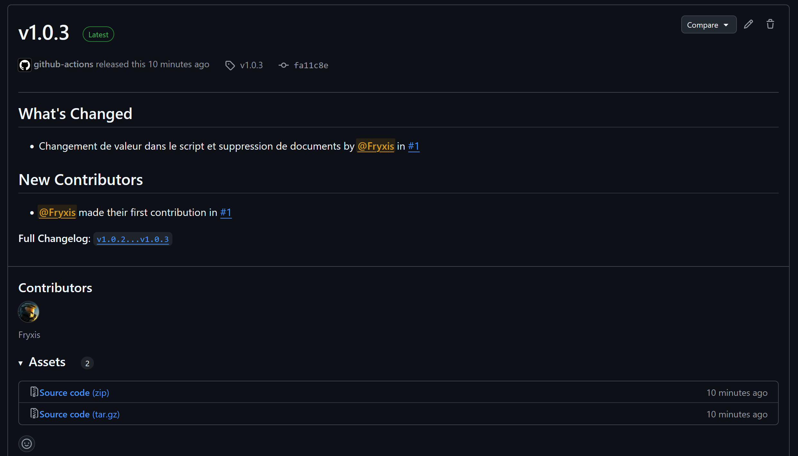
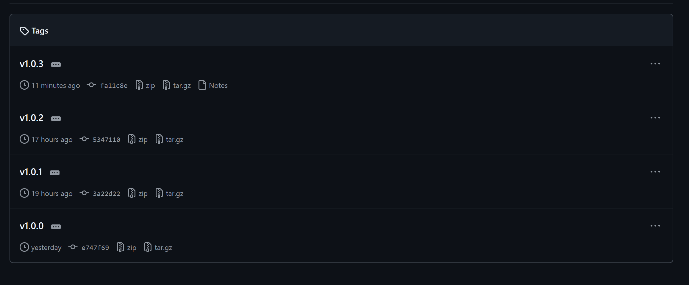
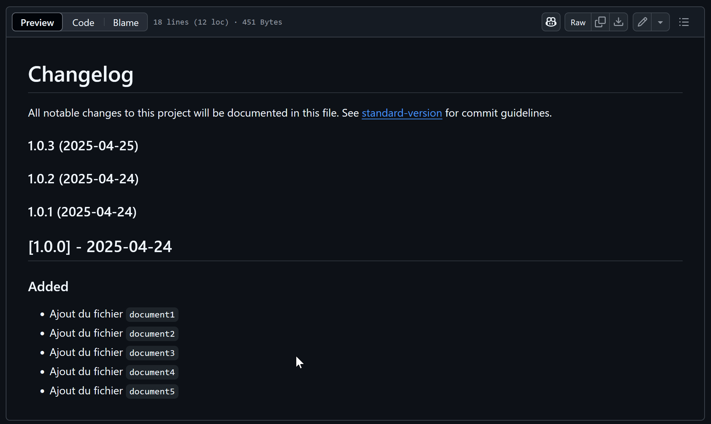

# 📝 RELEASE_REPORT.md

## 🎯 Objectif

Ce rapport documente la mise en œuvre d’un processus de gestion de version et de publication automatisée dans le cadre du TP CI/CD. L’objectif était de comparer plusieurs outils de versioning, de générer un changelog, de créer une release GitHub et d’automatiser le tout via un script `release.sh` et un pipeline CI.

---

## 🔧 Outils testés

| Outil               | Rôle                                                 | Utilisation retenue |
|---------------------|------------------------------------------------------|----------------------|
| `standard-version`  | Génère changelog + tag Git + bump de version         | ✅ Oui               |
| `release-it`        | Outil CLI complet pour versioning + release GitHub   | ✅ Oui               |
| `semantic-release`  | CI/CD full auto basé sur les commits                 | ✅ Oui (CI only)     |
| `gh` (GitHub CLI)   | Création de releases GitHub depuis la CLI            | ✅ Oui               |

---

## ⚙️ Fonctionnement du script `release.sh`

Le script supporte 3 modes, selon l’outil passé en argument :

```bash
./release.sh standard-version
./release.sh release-it
./release.sh semantic-release
```
## Étapes automatisées :
- ✅ Lancement des tests (npm test)
- ✅ Bump de version (SemVer)
- ✅ Génération d’un changelog structuré (format conventional commits)
- ✅ Création et push du tag vX.Y.Z
- ✅ Commit du CHANGELOG.md
- ✅ Publication de la release GitHub avec changelog (section “What’s Changed”)

## 🤖 Intégration CI (GitHub Actions)
Un workflow release.yml a été ajouté dans .github/workflows :

- Déclenché à chaque push sur main
- Exécute semantic-release automatiquement
- Génère le CHANGELOG.md, le tag, la release GitHub
- Exemples de messages générés :
    - feat(api): ajout de l'authentification
    - fix(route): correction des erreurs 500 sur /login

## 📂 Exemple de changelog généré

## [1.0.3] - 2025-04-25

### 🚀 Features
- **api**: ajout de la route de login sécurisée

### 🐛 Bug Fixes
- **route**: gestion des erreurs d'authentification

### 📦 Misc
- suppression de fichiers inutiles

## 📤 Exemple de release GitHub générée

- 📌 Tag : v1.0.3
- 📜 Titre : v1.0.3
- 📝 What's Changed :
    - feat: ajout de la route /login
    - fix: correction d’un bug sur l’erreur 500
- 👤 Contributors : @Fryxis
- 🔗 Full changelog : lien v1.0.2...v1.0.3

## ✅ Résultats obtenus

| Élement validé                  | Statut |
|--------------------------------|--------|
| `CHANGELOG.md` généré          | ✅     |
| Tag Git `v1.X.X`               | ✅     |
| Commit avec changelog          | ✅     |
| Release GitHub publiée         | ✅     |
| Intégration dans CI            | ✅     |
| Tests bloquants avant release  | ✅     |

---

## 💬 Analyse des outils

### `standard-version`

- 🔹 Simple à utiliser en CLI  
- 🔸 Moins flexible pour release GitHub sans script

### `release-it`

- 🔹 Interface interactive sympa  
- 🔸 Nécessite config `.release-it.json` pour personnaliser

### `semantic-release`

- ✅ Le plus **complet** pour intégration CI  
- ⚠️ Ne fonctionne **que dans CI/CD** (pas utilisable en local)

---

## 🧠 Retour d'expérience

- Le plus long a été la configuration propre du script pour qu’il soit réutilisable et structuré.
- `semantic-release` est clairement l'outil idéal pour production, mais `standard-version` + `gh` reste parfait en dev local.
- Le fait de **bloquer les releases si les tests échouent** est un vrai plus qualité.

---

## 📸 Captures & preuves

- ✅ [Release GitHub v1.0.3](#) *https://github.com/Fryxis/J3exercice1*

- ✅ Release GitHub v1.0.3  
  

- ✅ Tag Git v1.0.3  
  

- ✅ Changelog généré automatiquement  
  

---

## 🙌 Auteur

- **Nom** : Fryxis  
- **Projet** : [J3exercice]  
- **Date** : Avril 2025
